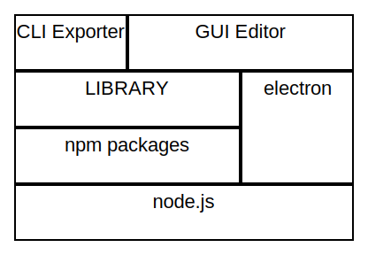

daisy cell block diagram (library)
====  

  

# Abort
「セルブロック図」の描画と、ファイルIOのためのライブラリ。  

  

# Detail
daisy-cell-block-diagram(以下、本ライブラリ)は、「セルブロック図」構想とそのファイルフォーマット(.daisydiagram)の実装です。  

本ライブラリを用いて、GUIアプリケーションによるエディタ daisy-cell-block-diagram-editor を提供する構想です。  

## セルブロック図
セルブロック図とは、等間隔のセルに沿ってブロックを配置し、ブロック間を矢印などのラインでつなぐ図表です。  
ブロック図・構造図・構成図を描くことを簡単にする、(多分・いちおう)新しい図表の種別です。  

以下の特徴があります。  
- セルに対してブロック要素を自由かつ規則的に配置できる。  
- ブロック要素は入れ子にすることができる。  
- 矢印や線のライン要素でブロック要素間をつなぐ。ブロックを移動してもラインは切れない。  
- ブロック間にマージンを空けることができる。意匠の調整や関係性の矢印を挿入する等に用いる。  

